# Architecture Diagram - WhatsApp Clone MVP

## Table of Contents
1. [High-Level Architecture](#high-level-architecture)
2. [Application Layers](#application-layers)
3. [File Dependency Map](#file-dependency-map)
4. [Data Flow Diagrams](#data-flow-diagrams)
5. [Firebase Data Model](#firebase-data-model)
6. [State Management Flow](#state-management-flow)

---

## High-Level Architecture

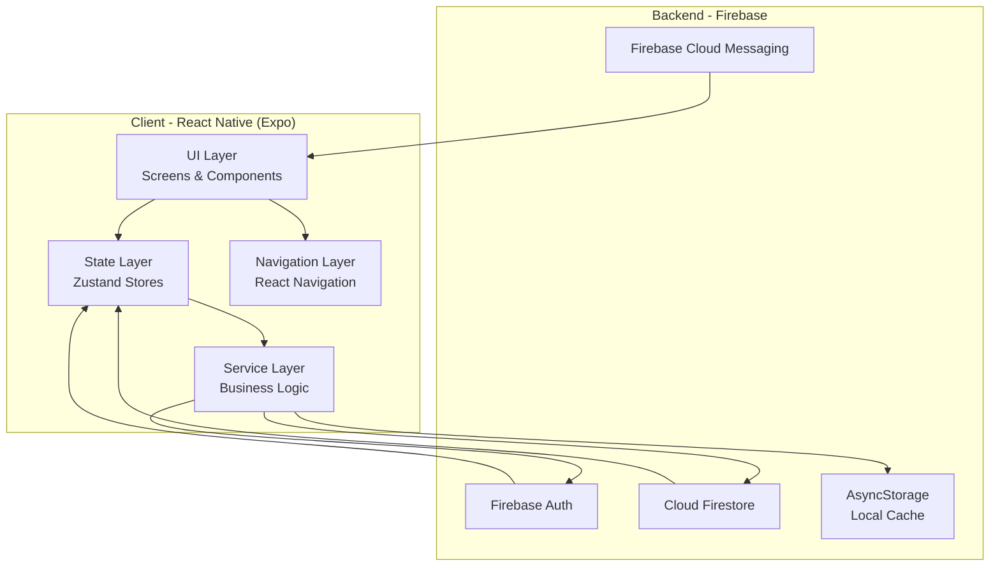

---

## Application Layers

### Layer 1: UI Layer (Screens & Components)

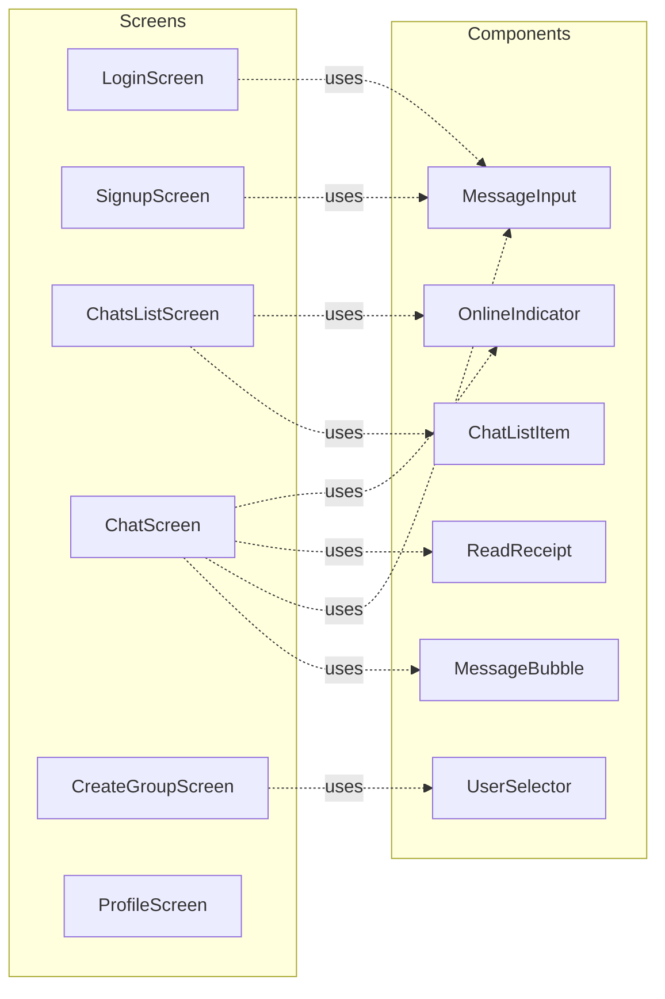

### Layer 2: State Management (Zustand Stores)

```mermaid
graph TB
    subgraph "Zustand Stores"
        AuthStore[authStore<br/>- user<br/>- loading<br/>- login/signup/logout]
        ChatStore[chatStore<br/>- chats[]<br/>- currentChat<br/>- subscribeToChats]
        MessageStore[messageStore<br/>- messages{}<br/>- addMessage<br/>- addOptimistic<br/>- updateStatus]
    end
    
    AuthStore --> ChatStore
    ChatStore --> MessageStore
```

### Layer 3: Service Layer

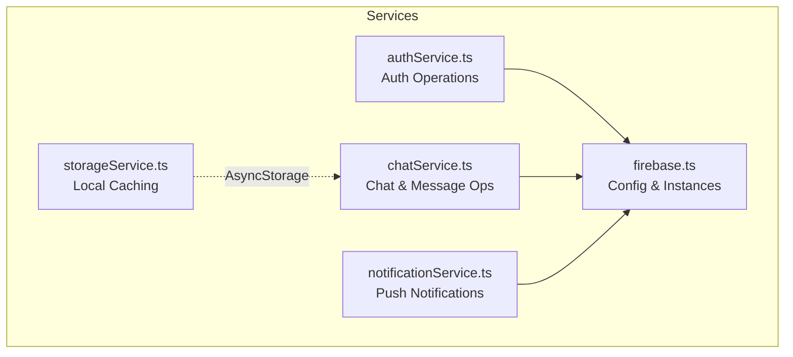

---

## File Dependency Map

### Complete Dependency Graph

```mermaid
graph TB
    %% App Entry
    App[App.tsx]
    
    %% Navigation
    AppNav[navigation/AppNavigator.tsx]
    
    %% Screens
    Login[screens/LoginScreen.tsx]
    Signup[screens/SignupScreen.tsx]
    ChatsList[screens/ChatsListScreen.tsx]
    Chat[screens/ChatScreen.tsx]
    CreateGroup[screens/CreateGroupScreen.tsx]
    Profile[screens/ProfileScreen.tsx]
    
    %% Components
    ChatItem[components/ChatListItem.tsx]
    MsgBubble[components/MessageBubble.tsx]
    MsgInput[components/MessageInput.tsx]
    OnlineInd[components/OnlineIndicator.tsx]
    ReadReceipt[components/ReadReceipt.tsx]
    UserSelect[components/UserSelector.tsx]
    
    %% Stores
    AuthStore[stores/authStore.ts]
    ChatStore[stores/chatStore.ts]
    MsgStore[stores/messageStore.ts]
    
    %% Services
    Firebase[services/firebase.ts]
    AuthSvc[services/authService.ts]
    ChatSvc[services/chatService.ts]
    NotifSvc[services/notificationService.ts]
    StorageSvc[services/storageService.ts]
    
    %% Utils
    Types[types/index.ts]
    DateHelpers[utils/dateHelpers.ts]
    MockData[utils/mockData.ts]
    
    %% App Dependencies
    App --> AppNav
    App --> AuthStore
    App --> NotifSvc
    
    %% Navigation Dependencies
    AppNav --> Login
    AppNav --> Signup
    AppNav --> ChatsList
    AppNav --> Chat
    AppNav --> CreateGroup
    AppNav --> Profile
    AppNav --> AuthStore
    
    %% Screen Dependencies - Auth
    Login --> AuthStore
    Login --> Types
    Signup --> AuthStore
    Signup --> Types
    
    %% Screen Dependencies - Chats
    ChatsList --> ChatStore
    ChatsList --> AuthStore
    ChatsList --> ChatItem
    ChatsList --> Types
    
    Chat --> ChatStore
    Chat --> MsgStore
    Chat --> AuthStore
    Chat --> MsgBubble
    Chat --> MsgInput
    Chat --> OnlineInd
    Chat --> ChatSvc
    Chat --> Types
    
    CreateGroup --> ChatStore
    CreateGroup --> AuthStore
    CreateGroup --> UserSelect
    CreateGroup --> ChatSvc
    CreateGroup --> Types
    
    Profile --> AuthStore
    Profile --> Types
    
    %% Component Dependencies
    ChatItem --> OnlineInd
    ChatItem --> DateHelpers
    ChatItem --> Types
    
    MsgBubble --> ReadReceipt
    MsgBubble --> DateHelpers
    MsgBubble --> Types
    
    MsgInput --> Types
    
    OnlineInd --> DateHelpers
    OnlineInd --> Types
    
    ReadReceipt --> Types
    
    UserSelect --> AuthStore
    UserSelect --> Types
    
    %% Store Dependencies
    AuthStore --> AuthSvc
    AuthStore --> Types
    
    ChatStore --> ChatSvc
    ChatStore --> Types
    
    MsgStore --> ChatSvc
    MsgStore --> StorageSvc
    MsgStore --> Types
    
    %% Service Dependencies
    AuthSvc --> Firebase
    AuthSvc --> Types
    
    ChatSvc --> Firebase
    ChatSvc --> Types
    
    NotifSvc --> Firebase
    NotifSvc --> Types
    
    StorageSvc --> Types
    
    %% Firebase base
    Firebase --> Types
    
    style App fill:#e1f5ff
    style AuthStore fill:#fff4e1
    style ChatStore fill:#fff4e1
    style MsgStore fill:#fff4e1
    style Firebase fill:#ffe1e1
```

### Simplified Layer Dependencies

```
┌─────────────────────────────────────────────────────────────┐
│                         App.tsx                              │
│                    (Entry Point)                             │
└────────────────────────┬────────────────────────────────────┘
                         │
                         ↓
┌─────────────────────────────────────────────────────────────┐
│                  Navigation Layer                            │
│              AppNavigator.tsx                                │
│  ┌──────────────┐  ┌──────────────┐  ┌──────────────┐      │
│  │ Auth Stack   │  │  Main Stack  │  │ Group Stack  │      │
│  └──────────────┘  └──────────────┘  └──────────────┘      │
└────────────────────────┬────────────────────────────────────┘
                         │
         ┌───────────────┼───────────────┐
         ↓               ↓               ↓
┌────────────────┐ ┌─────────────┐ ┌──────────────┐
│    Screens     │ │ Components  │ │    Stores    │
│                │ │             │ │              │
│ • LoginScreen  │ │ • ChatList  │ │ • authStore  │
│ • ChatsList    │ │   Item      │ │ • chatStore  │
│ • ChatScreen   │ │ • Message   │ │ • message    │
│ • CreateGroup  │ │   Bubble    │ │   Store      │
│ • Profile      │ │ • MessageIn │ │              │
│                │ │   put       │ │              │
└────────┬───────┘ └──────┬──────┘ └──────┬───────┘
         │                │               │
         └────────────────┼───────────────┘
                          ↓
         ┌────────────────────────────────┐
         │       Service Layer             │
         │                                 │
         │  ┌──────────┐  ┌────────────┐ │
         │  │ auth     │  │ chat       │ │
         │  │ Service  │  │ Service    │ │
         │  └──────────┘  └────────────┘ │
         │  ┌──────────┐  ┌────────────┐ │
         │  │ notif    │  │ storage    │ │
         │  │ Service  │  │ Service    │ │
         │  └──────────┘  └────────────┘ │
         └────────────────┬───────────────┘
                          │
         ┌────────────────┼────────────────┐
         ↓                ↓                ↓
    ┌─────────┐    ┌──────────┐    ┌──────────┐
    │Firebase │    │Firestore │    │AsyncStor │
    │  Auth   │    │          │    │   age    │
    └─────────┘    └──────────┘    └──────────┘
```

---

## Data Flow Diagrams

### 1. Authentication Flow

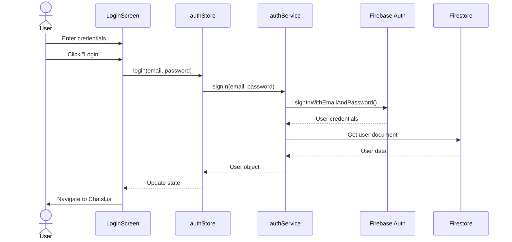

### 2. Send Message Flow (with Optimistic Updates)

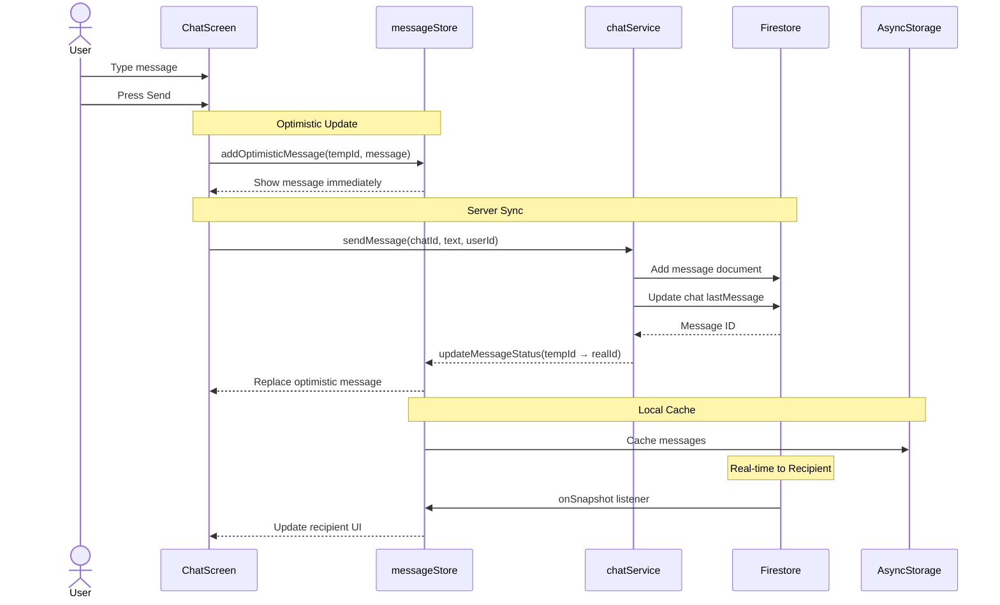

### 3. Real-Time Message Receive Flow

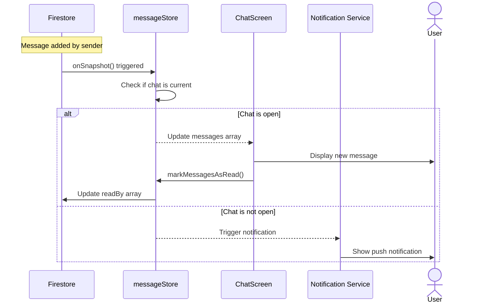

### 4. Group Chat Creation Flow

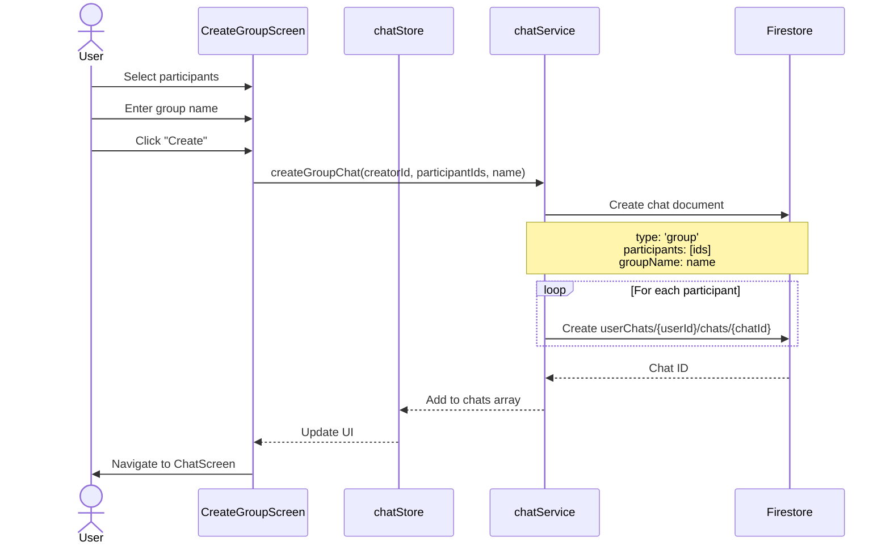

### 5. Read Receipt Flow

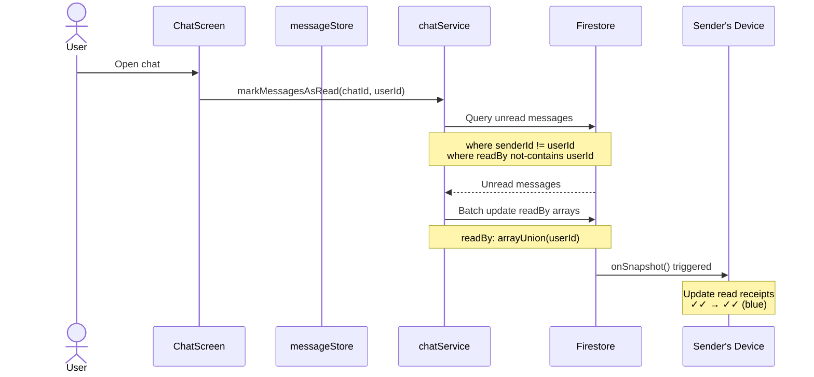

### 6. Online/Offline Status Flow

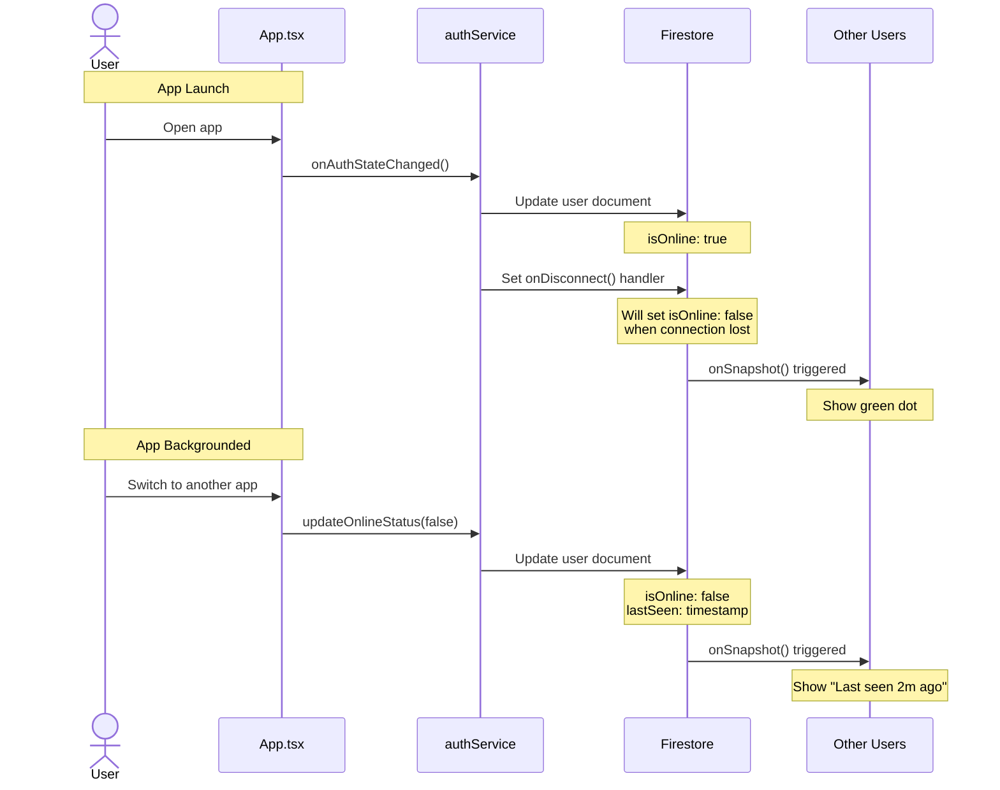

### 7. Offline Message Queue Flow

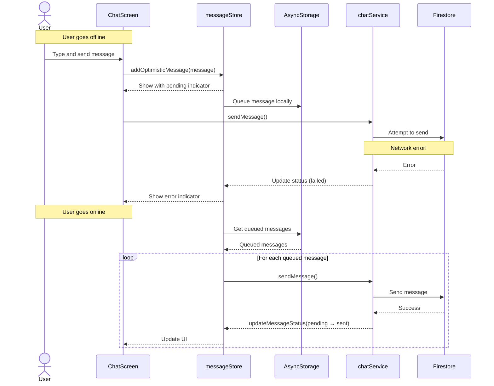

### 8. Push Notification Flow

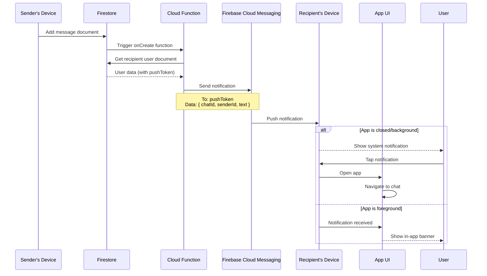

---

## Firebase Data Model

### Collections Structure

```
firestore
├── users
│   └── {userId}
│       ├── email: string
│       ├── displayName: string
│       ├── photoURL: string | null
│       ├── isOnline: boolean
│       ├── lastSeen: timestamp
│       └── pushToken: string | null
│
├── chats
│   └── {chatId}
│       ├── type: 'direct' | 'group'
│       ├── participants: string[] (userIds)
│       ├── lastMessage: string
│       ├── lastMessageTime: timestamp
│       ├── createdAt: timestamp
│       ├── groupName?: string (if type === 'group')
│       └── groupPhoto?: string (if type === 'group')
│
├── messages
│   └── {chatId}
│       └── messages
│           └── {messageId}
│               ├── text: string
│               ├── senderId: string
│               ├── timestamp: timestamp
│               └── readBy: string[] (userIds)
│
└── userChats
    └── {userId}
        └── chats
            └── {chatId}
                ├── chatId: string
                ├── unreadCount: number
                └── lastViewed: timestamp
```

### Data Relationships

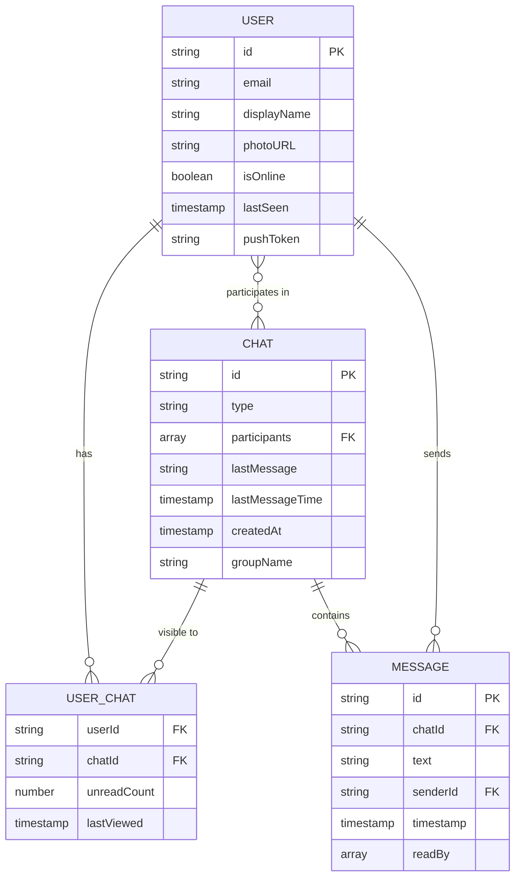

---

## State Management Flow

### Zustand Store Architecture

```mermaid
graph TB
    subgraph "React Components"
        Screen1[Screens]
        Comp1[Components]
    end
    
    subgraph "Zustand Stores"
        direction TB
        
        subgraph "authStore"
            AS_State[State:<br/>user, loading, error]
            AS_Actions[Actions:<br/>login, signup, logout,<br/>updateOnlineStatus]
        end
        
        subgraph "chatStore"
            CS_State[State:<br/>chats[], currentChat,<br/>loading]
            CS_Actions[Actions:<br/>setChats, setCurrentChat,<br/>subscribeToChats]
        end
        
        subgraph "messageStore"
            MS_State[State:<br/>messages{chatId: Message[]},<br/>loading]
            MS_Actions[Actions:<br/>addMessage, addOptimistic,<br/>updateStatus, subscribeToMessages]
        end
    end
    
    subgraph "Services"
        AuthSvc[authService]
        ChatSvc[chatService]
        StorageSvc[storageService]
    end
    
    subgraph "Backend"
        Firebase[Firebase]
        AsyncStorage[AsyncStorage]
    end
    
    Screen1 --> AS_State
    Screen1 --> CS_State
    Screen1 --> MS_State
    Comp1 --> AS_State
    Comp1 --> CS_State
    Comp1 --> MS_State
    
    Screen1 --> AS_Actions
    Screen1 --> CS_Actions
    Screen1 --> MS_Actions
    Comp1 --> AS_Actions
    Comp1 --> MS_Actions
    
    AS_Actions --> AuthSvc
    CS_Actions --> ChatSvc
    MS_Actions --> ChatSvc
    MS_Actions --> StorageSvc
    
    AuthSvc --> Firebase
    ChatSvc --> Firebase
    StorageSvc --> AsyncStorage
    
    Firebase -.real-time.-> AS_State
    Firebase -.real-time.-> CS_State
    Firebase -.real-time.-> MS_State
    AsyncStorage -.cached.-> MS_State
```

### Store Update Flow

```
User Action
    ↓
Component calls store action
    ↓
Store action calls service
    ↓
Service updates Firebase
    ↓
Firebase triggers real-time listener
    ↓
Listener updates store state
    ↓
React re-renders subscribed components
    ↓
UI updates
```

---

## Navigation Flow

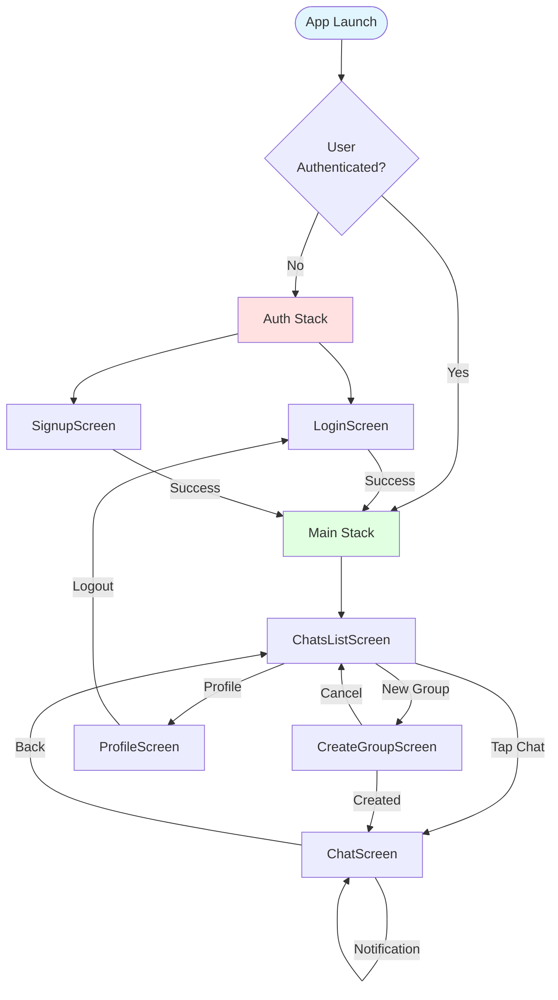

---

## Component Communication Patterns

### Pattern 1: Screen → Store → Service → Firebase

```typescript
// Used for: User actions that modify server state
ChatScreen → messageStore.addOptimisticMessage() → 
  chatService.sendMessage() → Firebase.addDoc()
```

### Pattern 2: Firebase → Service Listener → Store → Components

```typescript
// Used for: Real-time updates from server
Firebase.onSnapshot() → chatService.subscribeToMessages() →
  messageStore.setMessages() → ChatScreen re-renders
```

### Pattern 3: Store → Multiple Components

```typescript
// Used for: Sharing state across components
authStore.user → 
  ├─> ChatListScreen (for userId)
  ├─> ChatScreen (for senderId)
  ├─> ProfileScreen (for user info)
  └─> MessageBubble (to determine sent vs received)
```

### Pattern 4: Service → Cache → Store

```typescript
// Used for: Offline-first architecture
messageStore.subscribeToMessages() →
  ├─> AsyncStorage.getItem() (load cached)
  │     └─> messageStore.setMessages() (instant display)
  └─> Firebase.onSnapshot() (real-time sync)
        └─> messageStore.setMessages() (update with server data)
        └─> AsyncStorage.setItem() (update cache)
```

---

## Key File Responsibilities

### Services Layer

| File | Responsibility | Dependencies |
|------|----------------|--------------|
| `firebase.ts` | Initialize Firebase app, export instances | firebase SDK |
| `authService.ts` | Auth operations (login, signup, logout, presence) | firebase.ts, types |
| `chatService.ts` | Chat/message CRUD, real-time subscriptions | firebase.ts, types |
| `notificationService.ts` | Push notification registration & handling | expo-notifications, firebase.ts |
| `storageService.ts` | Local caching of messages | AsyncStorage, types |

### Stores Layer

| File | Responsibility | Dependencies |
|------|----------------|--------------|
| `authStore.ts` | Global auth state, user object | authService, types |
| `chatStore.ts` | List of user's chats, current chat | chatService, types |
| `messageStore.ts` | Messages per chat, optimistic updates | chatService, storageService, types |

### Screens Layer

| File | Responsibility | Dependencies |
|------|----------------|--------------|
| `LoginScreen.tsx` | Login form & validation | authStore |
| `SignupScreen.tsx` | Signup form & validation | authStore |
| `ChatsListScreen.tsx` | Display all user's chats | chatStore, ChatListItem |
| `ChatScreen.tsx` | Display messages, send messages | messageStore, chatStore, MessageBubble, MessageInput |
| `CreateGroupScreen.tsx` | Multi-select users, create group | chatService, UserSelector |
| `ProfileScreen.tsx` | Display user info, logout | authStore |

### Components Layer

| File | Responsibility | Dependencies |
|------|----------------|--------------|
| `ChatListItem.tsx` | Display single chat preview | OnlineIndicator, dateHelpers |
| `MessageBubble.tsx` | Display single message | ReadReceipt, dateHelpers |
| `MessageInput.tsx` | Text input + send button | None (receives callbacks) |
| `OnlineIndicator.tsx` | Show online/offline status | dateHelpers |
| `ReadReceipt.tsx` | Show checkmarks for read status | types |
| `UserSelector.tsx` | Multi-select list of users | authStore |

---

## Critical Data Paths

### Path 1: Message Sending (Happy Path)
```
User types message
  ↓
MessageInput.onSend()
  ↓
messageStore.addOptimisticMessage() ← UI updates immediately
  ↓
chatService.sendMessage()
  ↓
Firestore.addDoc('messages/chatId/messages')
  ↓
Firestore.updateDoc('chats/chatId', lastMessage)
  ↓
messageStore.updateMessageStatus() ← Replace optimistic with real
  ↓
storageService.cacheMessages() ← Cache locally
  ↓
Recipient's Firebase listener triggers
  ↓
Recipient's messageStore updates
  ↓
Recipient's ChatScreen re-renders
```

### Path 2: User Authentication
```
User enters credentials
  ↓
LoginScreen.handleLogin()
  ↓
authStore.login()
  ↓
authService.signIn()
  ↓
Firebase.signInWithEmailAndPassword()
  ↓
Firebase.onAuthStateChanged() triggers
  ↓
authService.updateOnlineStatus(true)
  ↓
Firestore.updateDoc('users/userId', isOnline: true)
  ↓
authStore.setUser()
  ↓
AppNavigator re-renders → MainStack
```

### Path 3: Real-Time Message Sync
```
Sender sends message (see Path 1)
  ↓
Firestore writes message
  ↓
Firestore triggers onSnapshot listener
  ↓
chatService.subscribeToMessages callback fires
  ↓
messageStore.addMessage()
  ↓
React detects state change
  ↓
ChatScreen re-renders with new message
  ↓
If screen is focused: markMessagesAsRead()
  ↓
Firestore updates message.readBy array
  ↓
Sender's listener triggers
  ↓
Sender sees read receipt update
```

---

## Performance Considerations

### Optimizations Implemented

1. **Optimistic Updates**: Messages appear instantly before server confirmation
2. **Local Caching**: AsyncStorage caches last 100 messages per chat
3. **Firestore Offline Persistence**: Built-in local cache
4. **Selective Re-renders**: Zustand selectors prevent unnecessary re-renders
5. **FlatList Virtualization**: Only renders visible messages
6. **Batch Writes**: Read receipts use batch operations

### Potential Bottlenecks

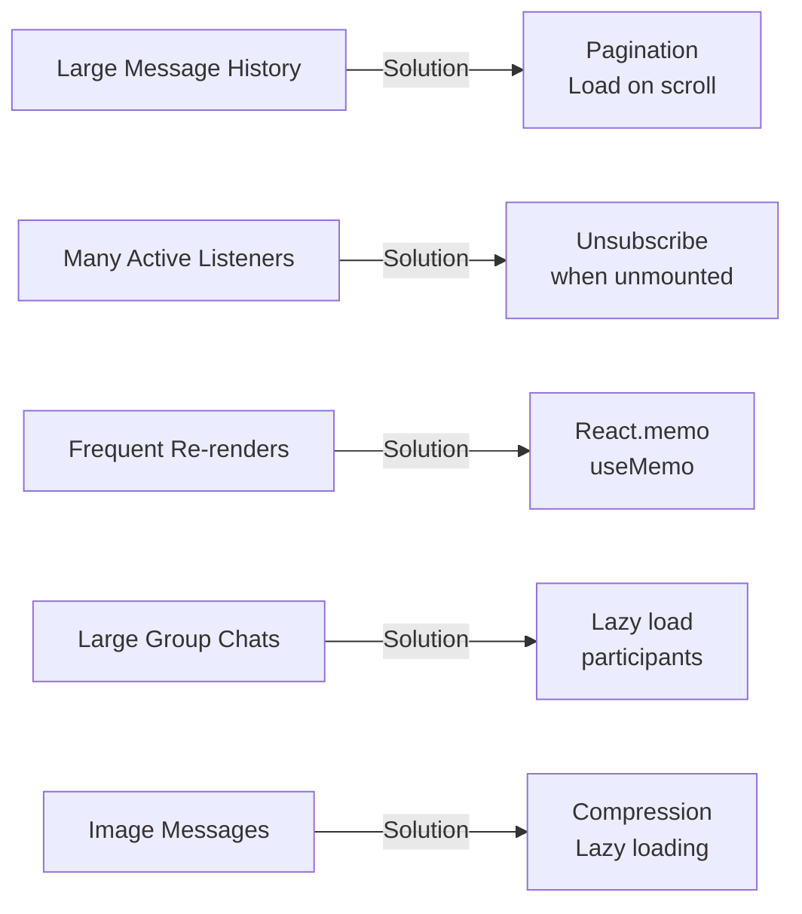

---

## Security Architecture

### Firestore Security Rules Flow

```
Client Request
    ↓
Firebase Auth validates token
    ↓
Firestore Security Rules check:
    - Is user authenticated?
    - Is user in chat.participants?
    - Is user the message sender?
    ↓
If allowed: Execute operation
If denied: Return permission error
```

### Security Rules Structure

```javascript
// Users: Read all, write own
users/{userId}
  - allow read: if authenticated
  - allow write: if request.auth.uid == userId

// Chats: Only participants
chats/{chatId}
  - allow read, write: if request.auth.uid in participants

// Messages: Only chat participants can read/create
messages/{chatId}/messages/{messageId}
  - allow read: if authenticated (checked via chat)
  - allow create: if authenticated
  - allow update: if request.auth.uid == senderId (for editing)
```

---

## Summary

This architecture implements a **three-tier client architecture** with clear separation of concerns:

1. **Presentation Layer** (Screens/Components): Pure UI, minimal logic
2. **State Layer** (Zustand Stores): Application state, coordinate data flow
3. **Service Layer** (Services): Business logic, Firebase operations

**Key architectural decisions:**
- ✅ Optimistic updates for perceived performance
- ✅ Real-time listeners for instant sync
- ✅ Local caching for offline support
- ✅ Zustand for lightweight state management
- ✅ Firebase for serverless backend
- ✅ Clear unidirectional data flow

**Data flow pattern:**
```
User Action → Store Action → Service → Firebase → 
Real-time Listener → Store Update → Component Re-render
```

This architecture supports all MVP requirements and is extensible for future AI features.

